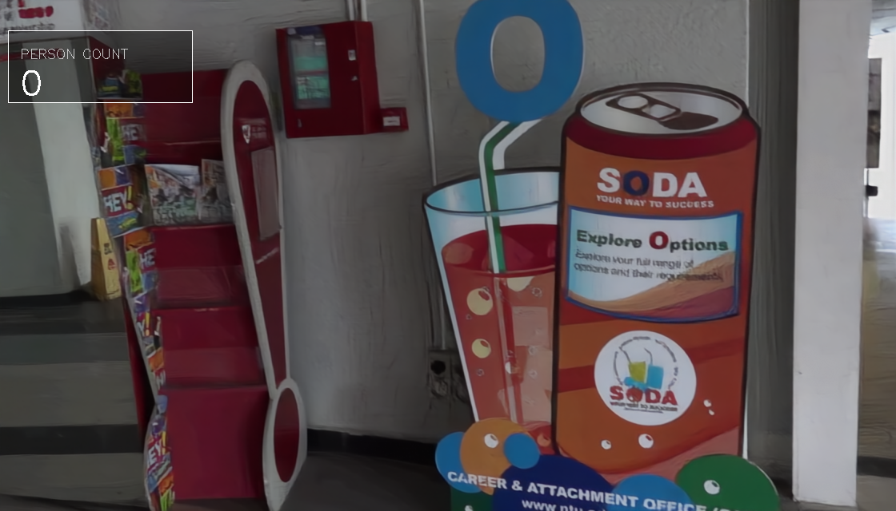
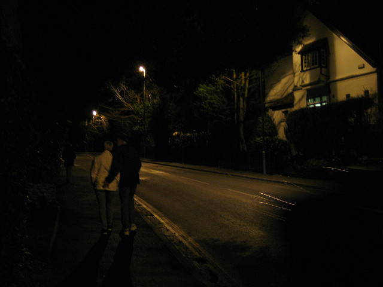
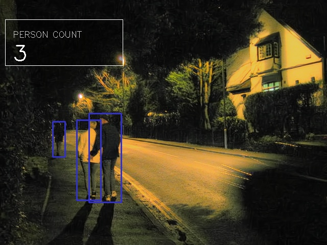

# 低光照环境下的行人检测与计数系统

> **Pedestrian Detection and Counting System in Low-Light Environments**

专业综合设计课程项目 —— 融合低光照图像增强与深度学习的行人检测计数系统。针对夜间、暗光场景下行人检测困难的问题，系统通过 **DarkIR / Zero-DCE** 两种低光增强网络对视频/图像进行亮度恢复，并行使用 **YOLOv8 + ByteTrack** 进行行人检测与多目标跟踪，实现精准的行人计数，有三种计数模式（全图计数、越线计数、区域计数）。系统提供 Web 界面（Flask + WebSocket）上传文件处理、实时推流、直播录像保存，历史记录查看。

***

## 项目结构

```
Pedestrian Detection and Counting System in Low-Light Environments/
│
├── app.py                         # Flask Web 应用主入口
├── main.py                        # 命令行工具入口
├── model.py                       # Zero-DCE 增强网络模型定义
├── image_filters.py               # 智能后处理（高光保护融合）
│
├── inference_DarkIR.py            # DarkIR 模型推理模块
├── inference_Zero_DCE.py          # Zero-DCE 模型推理模块
│
├── yolov8_predict.py               # YOLOv8 行人检测
├── yolo_count_bytetrack_stable.py  # ByteTrack 稳定行人计数
├── yolo_count_from_labels.py       # 基于标签文件的计数脚本 + CCTV 绘图工具函数
│
├── archs/
│   ├── DarkIR.py                   # DarkIR 网络主体
│   ├── arch_model.py               # 子模块：EBlock、DBlock、FreMLP、SimpleGate
│   └── arch_util.py                # 工具模块：LayerNorm2d、CustomSequential
│
├── options/
│   ├── DarkIR.yml                  # DarkIR 模型配置文件
│   └── options.py                  # YAML 配置解析器
│
├── templates/
│   ├── index.html                  # Web 主页
│   ├── result.html                 # 结果展示页
│   └── history.html                # 历史记录页
│
├── static/                         # 静态资源目录
├── requirement.txt                 # Python 依赖列表
├── start_ngrok.bat                 # ngrok 一键部署脚本
│
├── models/                         # 预训练模型权重
│   ├── best.pt                     # YOLOv8 行人检测权重
│   ├── DarkIR.pt                   # DarkIR 低光增强权重
│   └── Zero_DCE.pth                # Zero-DCE 低光增强权重
│
└── results.json                    # 历史处理记录
```

***

## 开发环境

| 组件      | 版本/说明                          |
| ------- | ------------------------------ |
| 操作系统    | Windows 10/11                  |
| Python  | 3.10+                          |
| CUDA    | 12.1                           |
| PyTorch | 2.5.1+cu121                    |
| 深度学习框架  | PyTorch, Ultralytics           |
| Web 框架  | Flask 3.1 + Flask-SocketIO 5.6 |
| 计算机视觉   | OpenCV 4.10, NumPy 2.0, Pillow |
| 目标检测    | YOLOv8                         |
| 多目标跟踪   | ByteTrack                      |
| 实时通信    | WebSocket (Flask-SocketIO)     |
| GPU 加速  | NVIDIA CUDA / Apple MPS / CPU  |
| 内网穿透    | ngrok                          |

***

## 安装依赖

```bash
# 1. 克隆或进入项目目录
cd "Pedestrian Detection and Counting System in Low-Light Environments"

# 2. 创建虚拟环境（推荐）
conda create -n lowlight python=3.10
conda activate lowlight

# 3. 安装 PyTorch（CUDA 12.1 版本）
pip install torch==2.5.1+cu121 torchvision==0.20.1+cu121 torchaudio==2.5.1+cu121 --index-url https://download.pytorch.org/whl/cu121

# 4. 安装其余依赖
pip install -r requirement.txt

# 5. 放置预训练模型权重到 models/ 目录
#    - best.pt      (YOLOv8 行人检测)
#    - DarkIR.pt    (DarkIR 增强)
#    - Zero_DCE.pth (Zero-DCE 增强)
```

模型的网盘下载链接: <https://pan.baidu.com/s/18x-qZ23T7ltvAKTBiFkdHA?pwd=khsq> 提取码: khsq

***

## 算法讲解

### 1. DarkIR 低光增强

DarkIR 是一种基于 **U-Net 架构** 的端到端低光照图像增强网络，定义在 [archs/DarkIR.py](archs/DarkIR.py)。

**网络结构：**

- **编码器（Encoder）：** 由多个 `EBlock` 组成，每个 EBlock 包含多尺度空洞卷积分支、通道注意力（SE-like）和**频域 MLP（FreMLP）**。频域 MLP 通过 FFT 将特征变换到频域，在幅度谱上做卷积处理，捕获全局光照信息。
- **下采样：** 使用 `Conv2d(stride=2)` 进行 2 倍下采样，同时通道数翻倍。
- **中间瓶颈层：** 编码器中间块 + 解码器中间块，使用带空洞卷积的 `DBlock`。
- **解码器（Decoder）：** 通过 **PixelShuffle** 上采样，与编码器对应层进行跳跃连接（skip connection），逐层恢复分辨率。
- **全局残差连接：** 最终输出与输入相加（`x + input`），网络学习的是增强残差。

**关键技术点：**

- 多尺度空洞卷积（dilations=\[1, 4, 9]）捕获不同感受野。
- 频域 MLP（FreMLP）处理全局光照上下文。
- SimpleGate 门控机制增强特征表达。
- LayerNorm2d 替代 BatchNorm，适应小 batch 推理。

**模型配置：** [options/DarkIR.yml](options/DarkIR.yml)

```yaml
network:
  name: DarkIR
  width: 64
  middle_blk_num_enc: 2
  middle_blk_num_dec: 2
  enc_blk_nums: [1, 2, 3]
  dec_blk_nums: [3, 1, 1]
  dilations: [1, 4, 9]
```

### 2. Zero-DCE 低光增强

Zero-DCE（Zero-Reference Deep Curve Estimation）是一种**零参考**低光增强网络，定义在 [model.py](model.py)。

**核心思想：** 不需要成对训练数据，通过预测**像素级高阶增强曲线参数**来实现图像提亮。

**网络结构：**

- 使用\*\*深度可分离卷积（Depthwise Separable Convolution）\*\*大幅减少参数量，构建轻量级无池化 U-Net。
- 7 层编解码结构 + 跳跃连接，输出 3 通道曲线参数 `x_r ∈ [-1, 1]`。
- 通过 **8 次迭代的高阶曲线**逐步增强图像：
  ```
  LE_n(x) = LE_{n-1}(x) + x_r * (LE_{n-1}(x)^2 - LE_{n-1}(x))
  ```

**优势：**

- 极轻量（< 100K 参数），推理速度快。
- 支持 12 倍下采样加速（`scale_factor=12`），适合实时视频流处理。

### 3. 高光保护滤镜

定义在 [image\_filters.py](image_filters.py)。基于**亮度平方蒙版**的自适应融合策略：

- 计算原始图像的亮度蒙版（亮区蒙版值接近 1）。
- 加权融合公式：`输出 = 原图 × 蒙版 + 增强图 × (1 - 蒙版)`
- 效果：亮部区域（如灯光、天空）保留更多原始像素，暗部区域使用增强结果，避免过曝。

### 4. YOLOv8 行人检测

定义在 [yolov8\_predict.py](yolov8_predict.py)。

- 使用 Ultralytics YOLOv8 模型进行行人检测（类别 ID=0, person）。
- **YoloMemoryPredictor** 类：接收 numpy 帧，直接返回检测框坐标列表，实现**零磁盘读写**的内存级推理。
- 置信度阈值 0.2，IoU 阈值 0.45。
- 自动设备选择：CUDA > MPS > CPU。

### 5. ByteTrack 多目标跟踪与计数

定义在 [yolo\_count\_bytetrack\_stable.py](yolo_count_bytetrack_stable.py)。

- 使用 **ByteTrack** 算法为每个行人分配稳定跟踪 ID。
- **滞后带（Hysteresis Band）防抖：** 在计数线两侧设置滞后区，只有明确跨越的轨迹才计入，避免边界抖动导致的重复计数。
- **稳定 ID 重连（Stable ID Reconnection）：** 基于脚点距离的贪心匹配，解决 ByteTrack 短时 ID 切换问题。
- **近期穿越去重：** 时间窗口 + 空间距离双重判断，防止同一人短时间内的重复计数。

### 6. 三种计数模式

| 模式   | 说明                                                    |
| ---- | ----------------------------------------------------- |
| 全图计数 | 统计画面中所有检测到的行人总数（ByteTrack 跟踪）                         |
| 越线计数 | 在画面中预设水平线（H1）或垂直线（V1/V2），统计跨越该线的行人数量，支持上下/左右方向过滤      |
| 区域计数 | 将画面划分为多个区域，统计进入/离开各区域的行人数，显示 CUR（当前）/ IN（进入）/ OUT（离开） |

***

## 运行方法

### 命令行模式

使用 `main.py` 进行独立的图像/视频增强，支持 5 种模式：

```bash
# 1. 单张图像增强 (DarkIR)
python main.py --mode image --input inputs/test.jpg --output results/enhanced.jpg

# 2. 批量图片文件夹增强 (DarkIR)
python main.py --mode batch --input inputs/ --output results/

# 3. 单个视频增强 (可选择 DarkIR 或 Zero-DCE)
python main.py --mode video --input videos/test.mp4 --output results/enhanced.mp4 --model darkir
python main.py --mode video --input videos/test.mp4 --output results/enhanced.mp4 --model zero_dce

# 4. 批量视频文件夹增强
python main.py --mode video_batch --input videos/ --output results/ --model darkir
python main.py --mode video_batch --input videos/ --output results/ --model zero_dce

# 5. 摄像头实时增强 (Zero-DCE)
python main.py --mode camera --camera_id 0
python main.py --mode camera --camera_id 0 --save_video --output camera.mp4
```

### Web 系统模式

```bash
# 启动 Flask Web 服务器
python app.py

# 浏览器访问
http://localhost:5000
```

Web 系统功能：

- **上传处理：** 上传图片/视频，选择增强模型和计数模式，在线处理并查看结果。
- **实时推流：** 通过 WebSocket 逐帧发送图像，实时增强 + 检测 + 计数，低延迟推流回前端。
- **直播录像：** 实时流可一键录制为 MP4 文件，自动计算真实帧率保存。
- **历史记录：** 管理员可查看所有处理记录，普通用户仅可见自己的记录。
- **管理员密码：** `666666`

### 公网访问（ngrok）

```bash
# 在桌面双击运行
start_ngrok.bat
```

需要登录Ngrok官网注册域名，在脚本里修改域名。脚本会自动启动 Flask 服务，运行app.py并通过 ngrok 创建公网隧道，生成 HTTPS 公网地址供外网访问。

***

## 结果呈现

系统处理完成后，结果页面展示以下信息：

- **处理结果文件：** 增强后的图像或带计数标注的视频（可直接在线播放/下载）。
- **行人计数：** 显示统计的行人数量（区域模式显示当前/进入/离开）。
- **处理耗时：** 记录从上传到完成的处理时长。
- **算法组合：** 显示本次处理使用的增强模型 + 检测模型。
- **计数模式标注：** 全图 / 越线 / 区域及对应的方向、位置。
- **CCTV 抬头信息：** 输出视频/帧上叠加摄像头 ID、时间戳、实时 FPS。

所有历史记录持久化存储在 `results.json` 中，可在历史页面查询。

***

## 效果展示

处理后的视频/图像上叠加以下可视化元素：

- **行人检测框：** 红色矩形框标注每个检测到的行人。
- **跟踪轨迹：** 黄色轨迹线显示行人移动路径，脚点黄色圆点标示当前脚部位置。
- **计数线/区域：** 半透明红色/蓝色线条标记计数边界。
- **计数面板：** 半透明黑色面板显示实时/累计行人数。
- **CCTV 抬头：** 顶部黑条显示摄像头 ID、时间戳、帧率。

低光照条件下的典型效果对比：

| 处理前                | 处理后                                                |
| ------------------ | -------------------------------------------------- |
| 暗光视频/图片，行人不可见或难以辨识 | DarkIR/Zero-DCE 增强后亮度增强，细节清晰，没有过曝，YOLOv8 行人准确检测并标注 |






***

## 作者联系方式

本项目为四人专业综合设计课程小组合作成果。
**联系邮箱：** <lqboyh@gmail.com>
